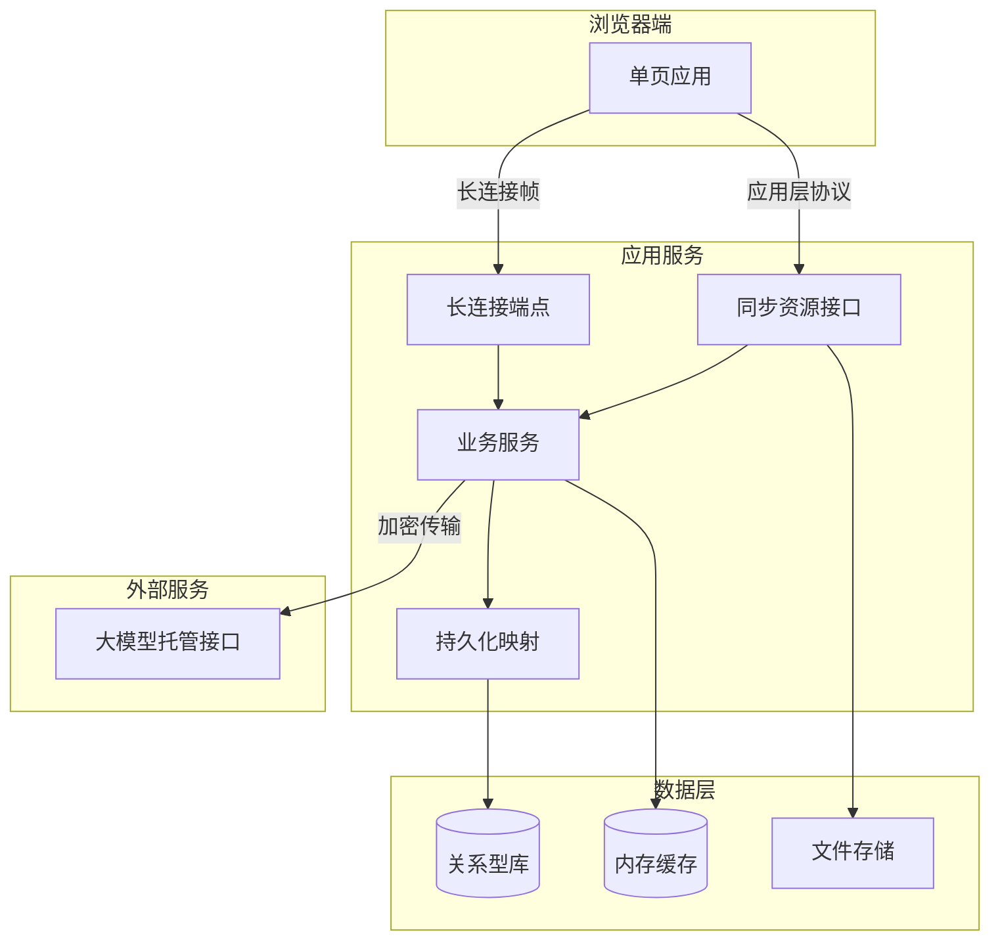
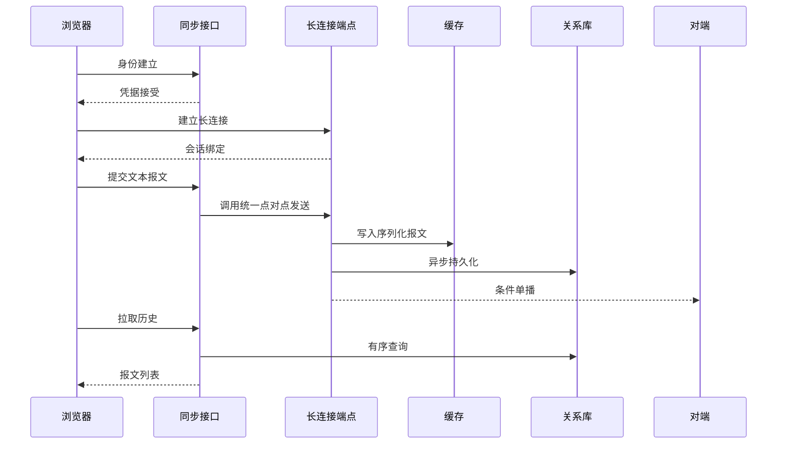
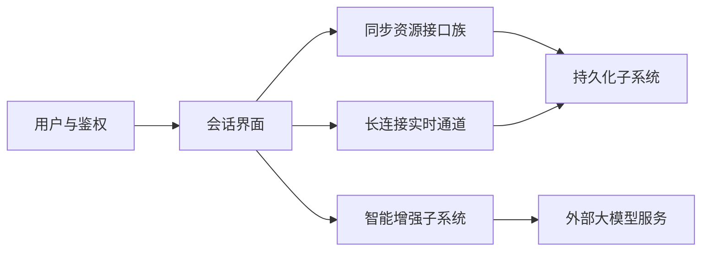
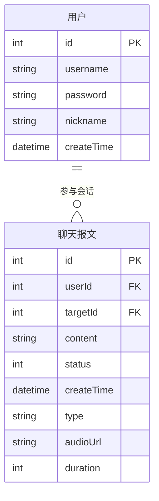
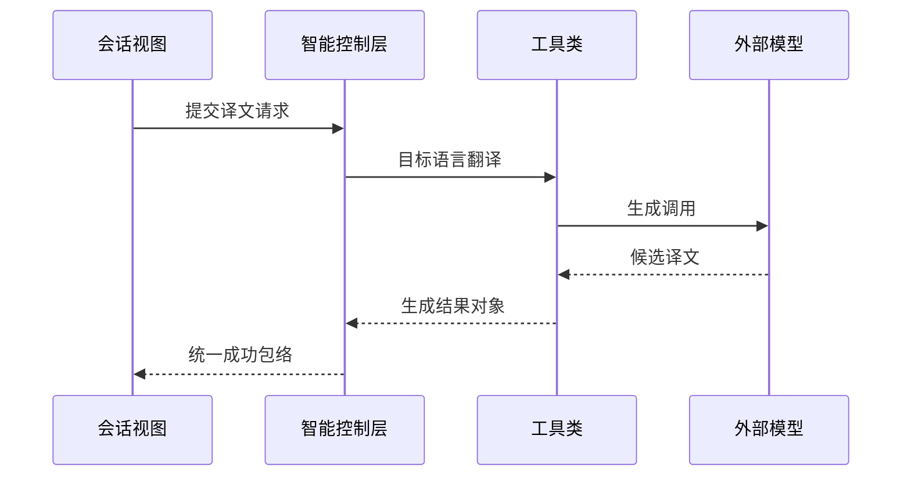
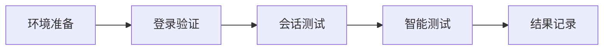

# 基于AI的跨语言即时通信与翻译系统的设计与实现

**说明**：本文为Markdown初稿，图表以Mermaid嵌入；定稿转入Word时请按学院模板设置版式。正文叙述中中文与西文词符相邻处一般不插空格（如SpringBoot、Vue3）；**英文题目与英文摘要**内仍按英语习惯保留单词间空格。代码块内保持源码原样。章节结构已与《论文大纲》中「1绪论—2相关知识—3系统设计—4数据库设计—5系统实现—6总结」对齐。

---

## 摘要与关键词

### 中文摘要

跨语言协作在Web场景下日益普遍，而独立翻译工具与即时通信系统在交互上长期割裂，易引发上下文迁移成本、会话节律被打断以及传统轮询机制下的带宽与延迟劣化等问题。本文围绕上述矛盾，设计并实现跨语言实时对话系统WaiChat。系统在结构上区分**实时信令与语义载荷的下行通道**与**依托大模型的语言加工通道**：前者由长连接承载以降低事件到达时延，后者由独立应用编程接口聚合至托管式大模型服务，从而在有限算力与周期约束下获得可调的智能增强强度。实现层面采用Vue3与Vite构造单页应用，SpringBoot整合安全框架、持久化组件与长连接端点，MySQL承担权威历史，Redis承接近期会话热数据，外部DashScope提供翻译、转写、润色与辅助生成等能力。系统在联调与功能验证中完成了单聊收发、历史管理、实时推送及主要智能辅助链路，达到毕业设计预期目标，并对连接鉴权、密钥管理与群聊扩展等后续工作作出展望。

**中文关键词**：跨语言通信；即时通信；SpringBoot；Vue3；WebSocket；大语言模型；机器翻译

### 英文题目

Design and Implementation of an AI-Based Cross-Language Instant Messaging and Translation System

### Abstract

Cross-language collaboration on the Web increasingly demands tight integration between conversational state and translation services. Standalone translation tools remain weakly coupled to instant messaging, often forcing users to switch applications and degrading real-time experience. This paper presents WaiChat, a cross-language real-time dialogue system that separates low-latency signaling from model-based language processing. The front end is implemented as a Vue 3 single-page application built with Vite; the back end uses Spring Boot with security, persistence, and WebSocket endpoints, combining MySQL for authoritative history and Redis for hot conversational windows, while large language model capabilities are accessed through managed APIs. Integration testing confirms stable one-to-one messaging, history management, push delivery, and the main intelligent assistance flows required by the graduation project. Limitations and future work are discussed regarding connection authentication, secret management, and group-chat extensions.

**Key words:** Cross-Language Communication, Instant Messaging, Spring Boot, Vue 3, WebSocket, Large Language Models, Machine Translation

---

## 1绪论

### 1.1研究目的与意义

全球化教学、远程协作与开源社区协作共同推高了跨语言信息交换的频率。若翻译能力与会话界面长期处于弱耦合状态，用户不得不在工具间复制粘贴话语片段，语义指称与指代关系随之断裂；若仅以短轮询模拟下行事件，则延迟下界受轮询间隔约束，空闲期仍产生大量无效请求。本课题旨在构造一套将**点对点会话**与**大模型驱动的翻译及语言辅助**置于同一浏览器会话内的原型系统，使研究者在有限周期内同时实践分层架构、实时通信与外部智能服务的工程封装，并在文档层面体现对非功能指标与安全边界的自觉。

### 1.2国内外研究现状

在Web实时通信谱系中，轮询与长轮询以牺牲带宽与尾延迟换取实现简单性；服务器推送事件简化了下行，却在高频双向控制场景下显得局促。WebSocket通过握手升级在单条TCP连接上提供成帧的全双工通道，降低了协议首部摊销，已成为低延迟会话类应用的主流选项之一[1][2]。在应用研究侧，即时通信产品形态成熟，但教学级实现往往将「管道可达」置于首位，对与会话状态强绑定的机器翻译编排讨论相对不足。

机器翻译研究已从规则与统计范式演进到神经翻译及大模型条件下的条件生成范式，工业界普遍通过云端API交付多语种能力。本课题不重复训练基座模型，而聚焦于**会话上下文与模型调用的编排**，与当前产业分工相一致，亦使论文创新点落在体系结构与接口契约而非单一算法指标上。

### 1.3本论文结构

第2章阐述WebSocket与实时Web、机器翻译技术代际及大模型应用编程接口调用的相关知识。第3章给出系统目标、总体架构、技术选型、核心业务流程与关键机制（含模块划分、接口协作与安全要点）。第4章专门讨论数据库概念、逻辑与物理设计及数据安全。第5章描述开发与运行环境、前后端与智能链路的实现、测试验证及成果展示。第6章总结全文并展望改进方向。

---

## 2相关知识

### 2.1Web实时通信与WebSocket

HTTP以请求—响应为主模型，服务器难以在业务事件发生时主动向已建立浏览会话的客户端推送数据，客户端定时轮询则带来延迟与无效请求。WebSocket在TCP之上定义轻量成帧协议，由握手阶段升级为双向字节流，使会话态可在连接生命周期内保持，适合事件驱动的会话业务[1]。与服务器推送事件相比，WebSocket提供全双工；与轮询相比，在维持长连接的前提下可显著降低首部冗余与端到端延迟，相关对比与测量工作已见诸文献[2][3][4]。本系统将**对端在线时的收包**绑定于WebSocket，而将历史分页、列表聚合等保留在同步语义更清晰的应用编程接口上，以利用无状态缓存与统一鉴权习惯。

工程上尚需关注连接与业务身份的绑定、异常关闭后的重连策略及报文版本化；本系统以JSON文本帧承载领域投影，并以统一错误包络回传失败语义。SpringFramework对长连接编程模型与容器集成提供了参考实现路径[5]。

### 2.2机器翻译至人工智能翻译的技术演进

规则与词典方法依赖专家规则，可解释性强但覆盖与维护成本高。统计机器翻译从平行语料学习对齐与翻译概率，使系统具备数据驱动特征，却在长距依赖与全局流畅度上存在瓶颈。神经机器翻译以端到端序列建模取代显式短语表，引入注意力与Transformer结构，显著改善了连贯性与训练并行度。进入大模型阶段后，翻译可视为条件生成任务，可利用上下文与指令做多任务扩展，亦引入幻觉、时延与调用成本等工程约束[6]。本文在通信框架内封装托管式大模型调用，强调**会话场景下的集成与体验**，而非重复完整训练流水线。

### 2.3大模型API调用

托管式大模型服务通常以HTTPS暴露同步或流式生成接口，调用方需在鉴权头或查询参数中携带密钥，并在应用侧实施超时、重试退避与配额感知，以避免尾部延迟传导至用户界面线程。请求与响应体往往为供应商特定JSON结构，领域系统宜通过传输对象与视图对象隔离，使内核模型不直接依赖外部字段命名。错误语义可能以HTTP状态码、业务码与可读消息并存的形式返回，客户端与服务端应统一映射为本地异常或统一包络，以降低多供应商切换时的适配成本。本系统通过JavaSDK发起调用，将提示模板、目标语言校验与结果抽取收敛于工具类，控制层仅编排成功与失败路径；与SpringBoot、持久化组件及前端的工程衔接详见第5章。

---

## 3系统设计

### 3.1系统目标与功能边界

跨语言即时通信的主要张力在于：会话过程要求下行语义在可感知延迟内到达，而大模型推理的时延与成本结构难以与每一帧收包同路径叠加。若将翻译与生成调用强行嵌入长连接帧处理线程，将放大尾延迟并恶化可预测性。据此，本系统在架构上将**实时信令与载荷传输**同**准实时的语言加工**解耦：前者由长连接与轻量JSON报文承担，后者由独立应用编程接口聚合至外部模型服务，使「实时性—智能性」可在部署参数层被调节。

功能边界上，系统向已注册用户提供点对点会话、联系人检索、文本与语音异构报文、会话历史的逻辑隐藏与恢复，以及在策略允许时接入机器翻译、语音转写、文本润色、智能回复建议、会话摘要与简易数据分析。刻意不包含大规模群组拓扑、端到端加密与完整可观测性平台，以便在本科设计周期内维持论证深度与实现可追溯性之间的平衡。

**【此处插入图3-1：系统功能边界与外部依赖关系示意】**

### 3.2总体架构与分层职责

系统采用浏览器与服务器分离形态：表现层由Vue3单页应用负责路由与会话状态机；应用层由SpringBoot同时暴露同步式资源接口与长连接端点，并封装领域服务与外部SDK；数据层由MySQL与Redis构成「权威—热窗口」组合；大模型能力以出站HTTPS调用接入，避免将生成式推理纳入本地事务边界。逻辑分层并不强制等于物理分进程：当前实现可在单一SpringBoot进程内共存REST控制器与长连接端点以降低运维复杂度；当负载增长时，可水平扩展无状态资源层，并将粘性会话与缓存集群协同迁移，该路径作为扩展点预留。

**图3-2系统逻辑分层示意**



表现层与两条服务端通道正交：同步接口便于携带请求—响应语义的错误传播与缓存语义，长连接帧适合低延迟下行。服务层被两类入口复用，可避免「双栈双写」导致的持久化竞争。缓存与关系型库通过异步落库与显式历史查询在语义上收敛；外部模型位于信任域外，领域对象与外部JSON之间以传输对象隔离，降低供应商协议演进对内核模型的侵蚀。

### 3.3关键技术选型及工程依据

实时下行若采用短轮询，其期望延迟与轮询间隔同阶增长，空闲期仍消耗无效请求；服务器推送事件简化了下行，却在高频双向控制场景下半双工局限明显。WebSocket在单连接上提供成帧全双工字节流，有利于降低连接建立次数与首部摊销，与低延迟会话目标一致[1][2]，故本系统将在线收包绑定于长连接，而将分页历史与列表聚合保留在同步资源接口。

数据栈方面，关系型库提供事务边界与结构化约束，适于账户与消息等需跨连接一致读写的实体；内存型缓存以常数时间入队与范围裁剪承接近期窗口，缓解写入尖峰。若取消缓存而仅依赖磁盘，突发发送易触发行锁与刷盘延迟；若取消关系型库而仅依赖内存，则在进程崩溃或驱逐时面临不可接受的数据丢失。因而采用「缓存承接热窗口、关系型库承担权威」的最终一致策略，并以异步任务削峰，持久化字段与索引安排见第4章。

大模型能力采用托管API而非自研基座，是在周期、算力与数据合规约束下的理性取舍：创新点集中于**会话编排与调用策略**，而非重复造轮子式的模型训练。

### 3.4核心业务流程与双通道发送范式

身份建立后，客户端在视图挂载阶段创建含用户标识的长连接，并在消息回调中完成JSON反序列化、会话匹配与未读聚合。发送侧并未将文本与语音强行绑在同一路径：文本优先经控制层同步发送接口进入统一点对点发送例程，以便在响应体中表达「对端离线」等业务级失败；语音在完成分片上传并获得可访问定位符后，由客户端直接经长连接发送轻量JSON，使二进制传输与信令解耦，同时仍落入同一发送例程，避免两套写路径分叉。由此形成的互补双通道，是在**可解释错误语义**与**减少一次服务器转发**之间的显式权衡，而非实现疏漏。

**图3-3核心消息投递与历史拉取时序**



身份建立与长连接绑定使服务端得以按用户主键索引会话对象，为单播提供常数时间查找前提。缓存写入先于异步持久化时，极短窗口内可能出现「已推送未落库」的中间态，故权威读仍以关系型库为准；该取舍换取推送路径尾延迟上界可控。

**【此处插入图3-4：聊天主界面含会话列表与消息区截图】**

### 3.5关键机制设计要点

#### 3.5.1连接与会话池、身份覆盖与统一点对点发送

服务端在连接打开阶段将会话注册至线程安全集合并以用户主键索引会话池；收到文本帧后反序列化为领域对象，并以当前连接绑定的用户标识覆盖报文内发送者字段，以阻断伪造发送者一类攻击面。统一点对点发送例程负责会话键规范化、缓存入队、异步落库与条件单播，是单一写入口的具体化；同步发送接口仅将请求委托给该例程。源码摘录如下。

```62:116:WaiChat-master/src/main/java/com/zafu/waichat/websocket/WebSocket.java
    @OnOpen
    public void onOpen(Session session, @PathParam("userId") Integer userId) {
        try {
            this.session = session;
            this.userId = userId;
            webSockets.add(this);
            sessionPool.put(userId, session);
            log.info("【WebSocket】有新的连接【{}】，总数为:{}", userId, webSockets.size());
        } catch (Exception e) {
            throw new RuntimeException(e);
        }
    }
    @OnMessage
    public void onMessage(String message, Session session) {
        log.info("【WebSocket】收到来自【{}】的消息:{}", userId, message);
        try {
            Chat chat = objectMapper.readValue(message, Chat.class);
            chat.setUserId(this.userId);
            if (chat.getCreateTime() == null) {
                chat.setCreateTime(LocalDateTime.now());
            }
            sendOneMessage(chat);
        } catch (Exception e) {
            log.error("消息处理失败", e);
            try {
                session.getBasicRemote().sendText(objectMapper.writeValueAsString(
                        Result.error("消息发送失败：" + e.getMessage())
                ));
            } catch (IOException ex) {
                log.error("发送错误反馈失败", ex);
            }
        }
    }
```

```149:185:WaiChat-master/src/main/java/com/zafu/waichat/websocket/WebSocket.java
    public void sendOneMessage(Chat chat) throws Exception {
        String targetId = String.valueOf(chat.getTargetId());
        String senderId = String.valueOf(chat.getUserId());
        String redisKey = getChatKey(senderId, targetId);
        chat.setCreateTime(LocalDateTime.now());
        String messageJson = objectMapper.writeValueAsString(chat);
        redisUtil.lPush(redisKey, messageJson);
        redisUtil.expire(redisKey, 7, TimeUnit.DAYS);
        CompletableFuture.runAsync(() -> {
            try {
                chatService.saveChatMessage(chat);
            } catch (Exception e) {
                log.error("数据库异步落库失败", e);
            }
        });
        Session session = sessionPool.get(chat.getTargetId());
        if (session != null && session.isOpen()) {
            session.getAsyncRemote().sendText(messageJson, result -> {
                if (!result.isOK()) log.error("WS推送失败: {}", result.getException().getMessage());
            });
        }
    }
```

```28:37:WaiChat-master/src/main/java/com/zafu/waichat/controller/ChatController.java
    @PostMapping("/send")
    public Result sendMessage(@RequestBody Chat chat) {
        try {
            webSocket.sendOneMessage(chat);
            return Result.success();
        } catch (Exception e) {
            return Result.error(e.getMessage());
        }
    }
```

#### 3.5.2客户端双通道与乐观更新

客户端在挂载阶段建立长连接；文本经浏览器请求提交至聊天发送接口，失败时迁移离线或错误状态；语音在上传成功后经长连接直发领域投影。摘录如下。

```1467:1510:WaiChat-vue/src/views/Chat.vue
    if (this.userId) {
      this.ws = new WebSocket(`/ws/${this.userId}`)
      this.ws.onmessage = (event) => {
        try {
          const data = JSON.parse(event.data)
          const senderId = data.userId || data.senderId
          const message = buildRealtimeMessage(data, senderName)
          if (this.selectedContactId != senderId) {
            this.unreadCounts[senderId] = (this.unreadCounts[senderId] || 0) + 1
            this.showNotification(`收到来自 "${senderName}" 的新消息`)
          } else {
            this.messages.push(message)
            if (this.autoTranslate) {
              this.translateSingleMessage(message)
            }
            this.scrollToBottom()
          }
        } catch (e) {
          console.warn('WS error', e)
        }
      }
    }
```

（上段为突出结构略去熟人分支内联系人数组更新，定稿应与仓库一致。）

```1166:1208:WaiChat-vue/src/views/Chat.vue
    async sendMessage() {
      if (!this.message.trim() || !this.selectedContactId) return
      const newMessage = {
        id: Date.now(),
        senderId: this.userId,
        senderName: '我',
        targetId: this.selectedContactId,
        targetName: this.currentContactName,
        content: this.message,
        status: 'sending',
        translatedContent: null,
      }
      this.messages.push(newMessage)
      this.scrollToBottom()
      const messageContent = this.message
      this.message = ''
      try {
        const response = await fetch('/api/chat/send', {
          method: 'POST',
          headers: { 'Content-Type': 'application/json' },
          body: JSON.stringify({
            userId: this.userId,
            targetId: this.selectedContactId,
            content: messageContent,
          }),
        })
        const data = await response.json()
        if (data.code === CODES.SUCCESS) {
          newMessage.status = 'sent'
          const contactIndex = this.contacts.findIndex((c) => c.id == this.selectedContactId)
          if (contactIndex !== -1) {
            this.contacts[contactIndex].lastMessage = messageContent
            this.contacts.unshift(this.contacts.splice(contactIndex, 1)[0])
          }
        } else {
          newMessage.status = 'offline'
          this.showNotification(data.msg || '对方不在线', 'error')
        }
      } catch (error) {
        newMessage.status = 'error'
        this.showNotification('发送失败', 'error')
      }
    }
```

**【此处插入图3-5：会话列表、消息区与发送区同框截图】**

#### 3.5.3逻辑模块划分

系统在文档层面划分为用户与鉴权、即时通信、媒体与智能增强三类子系统，并以有向无环依赖组织：鉴权为同步接口与长连接提供安全上下文；通信子系统维护会话拓扑与路由不变式；智能增强在已定位资源与文本载荷上叠加生成式调用，且不得反向依赖鉴权内核。

**图3-6功能模块依赖关系**



**【此处插入图3-7：模块依赖组件图或分层依赖图（导出）】**

#### 3.5.4接口契约与长连接和同步接口的协作不变式

同步资源接口族按职责覆盖身份建立、用户检索、聊天历史与联系人、会话隐藏与恢复、语音上传及翻译润色转写等；统一响应包络便于前端同构处理。任一进入持久化流水线的报文，无论由同步接口还是长连接触发，均须经过统一点对点发送例程，以保证缓存键、异步落库与条件单播的副作用集合一致；同步路径不得绕过该例程直写关系型库，长连接路径亦不得在例程外重复持久化。

#### 3.5.5安全与资源接入约束

连接串与模型密钥宜经环境变量或密钥服务注入。长连接路径参数应与服务器侧会话态强绑定，生产应引入短期令牌或握手内二次校验。上传路径应限制类型与尺寸并规范化存储路径；语音资源定位符的后续转写调用应校验其位于受信命名空间，以降低服务端请求伪造风险沿调用链传导的可能。

**【此处插入图3-8：安全配置与部署拓扑（可选）】**

---

## 4数据库设计

### 4.1概念结构设计

用户与聊天报文在概念上为一对多：任一对端对在时间轴上展开为报文偏序集。有向边由发送方与接收方两列表达，状态字段可编码会话级业务（如逻辑隐藏）。类型字段区分文本与语音，语音场景以资源定位符与时长补充载荷，使异构内容共享同一表族而不分裂存储。

**图4-1核心实体关系示意**



### 4.2逻辑结构设计

用户表承载账户主键、登录名、口令摘要、昵称及创建时间等字段，支撑鉴权与展示。聊天报文表承载主键、发送方与接收方外键、正文、状态、创建时间，以及消息类型、语音地址与时长等扩展列，与领域类`User`、`Chat`一致。若存在独立语言配置表，可在本节补充其与智能子系统读路径的关系。

**表4-1用户表主要字段说明（示例，与实现类对齐）**

|字段|类型|说明|
|---|---|---|
|id|整型|主键，自增|
|username|字符串|登录名|
|password|字符串|口令不可逆摘要|
|nickname|字符串|展示昵称|
|createTime|日期时间|注册时间|

**表4-2聊天报文表主要字段说明（示例，与实现类对齐）**

|字段|类型|说明|
|---|---|---|
|id|整型|主键，自增|
|userId|整型|发送方用户主键|
|targetId|整型|接收方用户主键|
|content|字符串|文本正文或占位说明|
|status|整型|业务状态（含会话隐藏等语义）|
|createTime|日期时间|服务端生成时间|
|type|字符串|报文类型，如文本与语音|
|audioUrl|字符串|语音资源定位符，可空|
|duration|整型|语音时长秒，可空|

**【此处插入图4-2：与物理库一致的E-R导出图或表关系图】**

### 4.3物理设计与访问优化

历史查询通常按「当前用户—选定对端—时间升序」过滤，宜在发送方、接收方与创建时间组合上建立索引策略以控制全表扫描规模。缓存侧键空间与库表边语义应对齐，避免同一对端对在Redis与MySQL中出现无法对应的键分裂；具体键生成规则与第3章统一点对点发送例程一致。

### 4.4数据安全与完整性

口令仅存摘要；生产环境应对备份与日志脱敏。外键与级联策略按实际库表定义撰写；若采用逻辑删除或状态隐藏，应说明与查询条件的配套约束，防止已隐藏会话数据意外暴露于列表接口。

---

## 5系统实现（成果展示）

### 5.1开发与运行环境

前端开发服务器将应用编程接口前缀、长连接前缀与静态上传路径代理至本机后端进程；后端需JDK17、MySQL与Redis实例及模型服务密钥。仓库以Vue子工程与SpringBoot子工程分离，利于独立构建与持续集成。SpringBoot3与SpringSecurity、MyBatis-Plus及DashScope等JavaSDK的版本与依赖管理由构建描述文件约束，此处不展开版本号以免与仓库漂移。

### 5.2后端实现要点

控制层保持薄门面，领域规则位于服务与工具类。智能控制层暴露语言列表与翻译等入口，翻译路径接收传输对象，调用工具类完成生成，再封装为视图对象返回。

```72:84:WaiChat-master/src/main/java/com/zafu/waichat/controller/AIController.java
    @PostMapping("/translate")
    public Result translate(@RequestBody TranslateDTO translateDTO) {
        try {
            GenerationResult back = MessageUtil.translateWithTarget(translateDTO.getText(), translateDTO.getTarget());
            String result = back.getOutput().getChoices().get(0).getMessage().getContent();
            TranslateVO vo = new TranslateVO();
            vo.setTranslated(result);
            vo.setOriginal(translateDTO.getText());
            return Result.success(vo);
        } catch (Exception e) {
            return Result.error(e.getMessage());
        }
    }
```

### 5.3前端实现要点

主会话视图以本地状态维护报文列表、未读计数与智能处理中标志；翻译调用与后端契约一致。样式层采用设计令牌与玻璃拟态强化可读性，属表现层优化，不改变领域契约。

### 5.4AI与翻译调用链

**图5-1单条消息翻译时序**



### 5.5关键问题与处理

服务端在帧处理入口覆盖发送者标识，可缓解伪造风险，生产环境仍应引入令牌。文本经同步接口返回业务失败码，前端据此更新状态，改善可解释性。异步落库避免阻塞长连接线程，需配套线程池与失败日志，以免静默丢数。

**【此处插入图5-2：AI工具条或语音条与转写区域截图】**

### 5.6测试与验证

在本地开发环境以黑盒方式联调：采用主流Chromium内核浏览器，后端日志级别为INFO，数据库为测试实例。覆盖登录、联系人、报文收发、历史、语音上传、翻译及至少一种附加智能能力。

**表5-1核心功能测试结果**

|编号|场景|操作步骤|预期结果|实际结果|
|---|---|---|---|---|
|T1|登录|合法凭据提交|进入会话页并建立长连接|通过|
|T2|文本发送|选中对端并发送|在线则收包；离线则提示|通过|
|T3|历史拉取|切换会话|列表与后端一致|通过|
|T4|翻译|开启自动翻译并收外文|出现译文或错误提示|通过|
|T5|语音|短语音发送|出现语音条并可播放|通过|

尚未开展正式压力测试与安全渗透；模型接口受配额与网络抖动影响，异常路径需进一步埋点与退避重试。

**图5-3测试活动概要**



### 5.7成果展示

图3-2、图3-3、图3-6及第4章图4-1为逻辑与时序示意；图3-1及图3-4至图3-8、图4-2、图5-2等为运行截图或导出图占位。装订稿中宜将Mermaid导出为矢量图或高清位图，并与学院插图目录统一编号与图题。

**【此处插入图5-4：可选数据分析或总结弹窗截图】**

---

## 6总结与展望

### 6.1工作总结

本文完成了WaiChat跨语言即时通信与翻译系统的设计与实现：在体系结构上区分低延迟信令与模型调用链；在通信范式上采用长连接与同步资源接口的互补双通道；在数据栈上组合内存缓存与关系型权威库，并在第4章对库表与访问策略作出归纳；在智能侧以外部托管API实现翻译与多模态转写等能力。系统经联调与功能测试满足毕业设计主要目标。

### 6.2不足与展望

后续可在长连接握手阶段引入令牌校验与房间授权；扩展群组拓扑与已读回执；将文件存储迁移至对象存储并配套恶意内容扫描；为模型调用增加熔断、缓存与审计日志，以提升生产可用性与可观测性。

---

## 参考文献

[1]FETTEI,MELNIKOVA.RFC6455:TheWebSocketProtocol[S/OL].IETF,2011.https://www.rfc-editor.org/rfc/rfc6455.html.

[2]PIMENTELV,NICKERSONBG.CommunicatingandDisplayingReal-TimeDatawithWebSocket[J].IEEEInternetComputing,2012,16(4):45-53.DOI:10.1109/MIC.2012.64.

[3]PerformanceAnalysisofDataTransmissiononWebSocketforReal-TimeCommunication[C]//请在IEEE Xplore按文献号8898135补全会议名、地点、年、页码.

[4]PerformanceevaluationofWebsocketprotocolforimplementationoffull-duplexwebstreams[C]//请在IEEE Xplore按文献号6859715补全会议名、地点、年、页码.

[5]SpringFrameworkDocumentation.WebSocketSupport[EB/OL].https://docs.spring.io/spring-framework/reference/web/websocket.html

[6]（占位）宗成庆.统计自然语言处理[M].2版.北京:清华大学出版社,2018.（或替换为知网收录的神经机器翻译/大模型综述论文并补全卷期页码.）

[7]Vue.js.TheProgressiveJavaScriptFramework[EB/OL].https://vuejs.org/

[8]AlibabaCloud.DashScopeSDK文档[EB/OL].https://help.aliyun.com/zh/model-studio/

---

**全文排版自检**：中文叙述中西文词符相邻处一般不插空格；英文题目与摘要按英语习惯保留空格。代码引用块内保持源码原样。图号按章编排（第3章图3-×、第4章图4-×、第5章图5-×），并入学校模板时请统一核对图目录与表目录。
