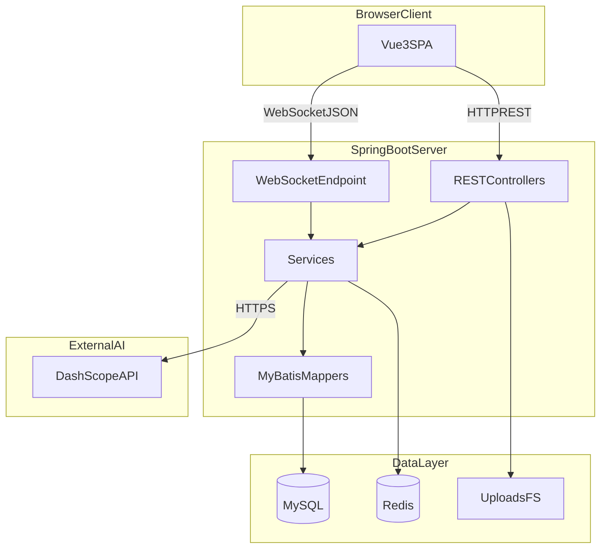
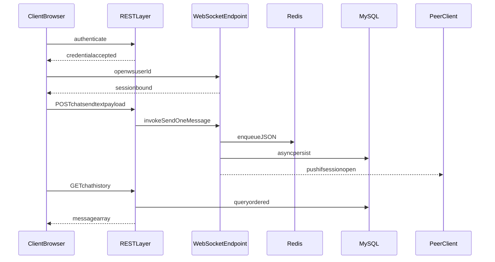
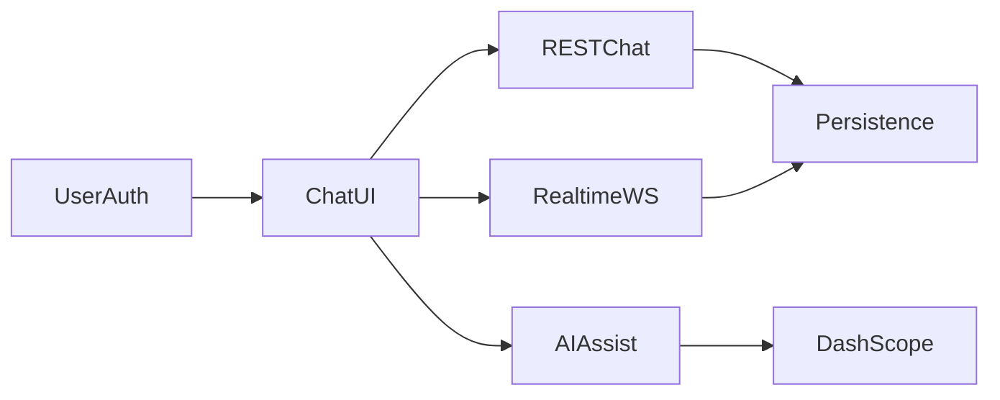
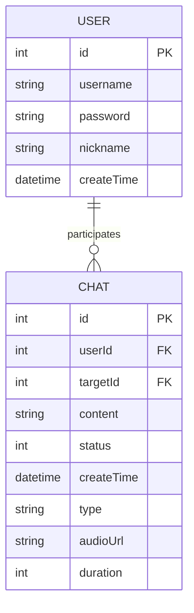

# 第3章 系统设计（3.1总体设计与3.2详细设计）

本章在既定功能边界与技术约束下，从体系结构、通信范式、数据与接口契约三个层面给出WaiChat跨语言即时通信与翻译系统的设计论证。论述遵循「问题场景—备选方案比较—设计决策—关键实现」的闭环，并在必要处辅以结构化图示与源码片段，以揭示工程权衡（Trade-off）而非罗列功能清单。

---

## 3.1总体设计

### 3.1.1系统目标与功能边界

跨语言即时通信场景的核心矛盾在于：一方面，会话过程要求低延迟、可预测的下行语义到达，以便维持交互节律；另一方面，翻译与语言增强能力依赖生成式模型，其推理时延与成本结构同实时链路存在张力。若将二者机械地叠置于同一同步调用路径，将导致首包时间恶化，并在高并发条件下放大尾部延迟。据此，本系统将**实时信令与语义载荷的传输**同**离线或准实时的语言加工**在架构上解耦：前者由长连接与轻量JSON报文承担，后者由独立REST接口聚合至大模型服务，从而在工程上获得可调的「实时性—智能性」折中面。

在功能边界上，系统面向已注册用户提供点对点会话、联系人检索、文本与语音异构消息、会话历史的逻辑隐藏与恢复，以及在用户显式或策略触发的条件下接入机器翻译、语音转写、文本润色、智能回复建议、会话摘要与简易数据分析等能力。刻意不包含大规模群组拓扑、端到端加密与完整可观测性平台，以降低状态空间复杂度，使设计论证能够聚焦于**双通道消息投递**、**缓存与持久化的分层一致性**及**外部模型服务的封装边界**，从而符合本科毕业设计在周期与深度上的约束条件。

**【此处插入图3-1：系统功能边界与外部依赖关系示意（可自绘UML包图或上下文图）】**

上图若采用UML用例或系统上下文形式，应突出浏览器、SpringBoot应用、MySQL、Redis、本地或对象存储、DashScope之间的数据与控制流边界，并与下文分层架构形成对照，便于读者建立「何处强一致、何处最终一致」的心理模型。

### 3.1.2总体架构与分层职责

在浏览器/服务器范式下，本系统采用前后端分离部署形态：表现层由Vue3单页应用承担，负责路由编排、会话状态机与可视化呈现；应用层由SpringBoot承载REST与WebSocket端点，封装领域服务与外部SDK调用；数据层由关系型库与内存型缓存共同构成，前者保证审计与历史可追溯，后者吸收写入尖峰并支撑热路径读；大模型能力以出站HTTPS调用形式接入，避免将生成式推理嵌入同步事务边界。

如图3-2所示，逻辑分层并非物理分机的唯一划分，而是职责正交的参考模型：同一SpringBoot进程内可同时驻留REST控制器、WebSocket端点与服务组件，以降低运维复杂度；当负载增长时，可将无状态API层水平扩展，而将WebSocket粘性会话与Redis集群协同迁移，该演进路径在总体设计阶段被预留为扩展点而非当期实现。

**图3-2系统逻辑分层示意**



对图3-2的解读要点如下。其一，Vue3SPA与REST、WebSocket之间形成两条正交通道：REST适合携带请求—响应语义的状态变更与错误传播，WebSocket适合下行事件流与低延迟推送。其二，服务层同时被REST与WebSocket复用，避免「双栈重复落库」导致的写入竞争。其三，Redis与MySQL构成典型的「热路径—冷存储」组合：前者以会话键聚合近期消息序列，后者承担权威历史与账户资料；二者通过异步写与显式历史查询接口在语义上收敛。其四，DashScope位于信任域之外，应用层仅通过DTO与VO隔离外部JSON结构，降低供应商协议变迁对领域模型的侵蚀。

### 3.1.3关键技术选型及工程依据

技术选型并非工具链的简单堆砌，而是在约束集合内对非功能指标的显式优化。就实时下行而言，短轮询在语义上等价于以时间离散化近似连续事件，其期望延迟与轮询间隔同阶增长，且在空闲期仍消耗无效请求；SSE虽可简化服务器推送，但语义上仍为半双工，难以在同一连接上承载客户端高频上行控制帧。相较之下，WebSocket在单一TCP连接上提供成帧的全双工字节流，使会话态得以在连接生命周期内保持，从而降低协议首部摊销与连接建立次数，这与低延迟会话场景的目标函数一致[1][2]。本系统据此将「对端在线时的收包」绑定于WebSocket，而将「历史分页、列表聚合」保留在REST，以利用HTTP缓存、幂等与统一鉴权模型。

在数据栈上，MySQL提供事务边界与结构化约束，适用于用户凭证、消息记录等需跨连接一致读写的实体；Redis则以O(1)入队与范围裁剪支持近期消息窗口，缓解写入尖峰对磁盘子系统的冲击。若取消Redis而仅依赖MySQL，则在突发发送场景下易触发行锁竞争与刷盘延迟；若取消MySQL而仅依赖Redis，则在进程崩溃或内存驱逐时面临不可接受的数据丢失风险。因而采用「Redis承接热窗口、MySQL承担权威」的最终一致策略，并在实现上以异步任务削峰，该权衡在3.1.5节代码层面有具体对应。

在大模型接入方式上，自研或私有化部署基座模型虽可增强可控性，但在毕业设计周期与算力预算约束下不具备可行性。通过DashScope等托管API，将翻译、润色、多模态转写等能力收敛为出站调用，使系统创新点集中于**会话语义与模型调用的编排**而非模型训练本身，这与第2章所述「翻译即生成」范式下的工程分工相一致。

### 3.1.4核心业务流程与双通道发送范式

身份建立后，客户端在应用挂载阶段创建指向`/ws/{userId}`的WebSocket实例，并在`onmessage`回调中完成JSON反序列化、会话匹配与未读计数聚合。该设计将「连接标识」与「业务用户主键」在路径参数层面对齐，使服务端能够在握手完成后以常数时间复杂度检索会话槽位；其代价在于生产环境需额外叠加令牌校验以防连接参数伪造，该安全加固在3.2.5节作为约束性说明给出。

在发送侧，系统并未将文本与语音强行统一为单一通道，而是形成**互补双通道**：文本发送优先经`POST/chat/send`进入控制层，由控制层转调与WebSocket共用的`sendOneMessage`方法，从而在同步响应体中承载「对端离线」等业务级失败语义；语音报文则在完成`multipart`上传并获得可访问URL后，由客户端直接`ws.send`序列化JSON，使二进制载荷与信令路径解耦，同时仍落入同一`sendOneMessage`持久化与推送流水线，避免两套写路径分叉。该Trade-off的直观含义是：文本路径牺牲部分协议纯粹性以换取错误传播的可解释性；语音路径牺牲部分「纯REST可观测性」以降低一次往返时延。

**图3-3核心消息投递与历史拉取时序**



**【此处插入图3-3（导出）：WebSocket核心消息推送与HTTP兜底时序图（可自PlantUML或Visio重绘）】**

对图3-3的补充解读如下。序列中「authenticate」抽象了SpringSecurity表单登录或等效机制，其细节在实现章展开；「sessionbound」表明连接池以用户主键索引`Session`对象，为后续单播推送提供O(1)查找前提。「enqueueJSON」与「asyncpersist」的先后次序体现「先写热数据、后异步落库」的乐观策略：若异步写失败，权威库与缓存将出现短暂分歧，系统依赖历史查询走MySQL、实时收包走推送合并的语义，在工程上接受最终一致而非强同步写穿，以换取推送路径的尾延迟上界。

### 3.1.5连接绑定、身份伪造防护与热路径写扩散抑制

在服务端，`@ServerEndpoint("/ws/{userId}")`将连接生命周期与显式用户主键耦合。`onOpen`将会话对象注册至线程安全的`CopyOnWriteArraySet`与`ConcurrentHashMap`索引的会话池，前者便于诊断与广播类扩展，后者支撑按主键定向单播。`onMessage`在反序列化客户端JSON为`Chat`实体后，**强制以连接绑定的`this.userId`覆盖报文内携带的发送者标识**，从而在协议层阻断「伪造发送者」一类攻击面；该设计隐含假设为：当前阶段以路径参数作为弱身份断言，生产部署应叠加会话令牌或双向TLS等强断言。

```62:116:WaiChat-master/src/main/java/com/zafu/waichat/websocket/WebSocket.java
    @OnOpen
    public void onOpen(Session session, @PathParam("userId") Integer userId) {
        try {
            this.session = session;
            this.userId = userId;
            webSockets.add(this);
            sessionPool.put(userId, session);
            log.info("【WebSocket】有新的连接【{}】，总数为:{}", userId, webSockets.size());
        } catch (Exception e) {
            throw new RuntimeException(e);
        }
    }
    @OnMessage
    public void onMessage(String message, Session session) {
        log.info("【WebSocket】收到来自【{}】的消息:{}", userId, message);
        try {
            Chat chat = objectMapper.readValue(message, Chat.class);
            chat.setUserId(this.userId);
            if (chat.getCreateTime() == null) {
                chat.setCreateTime(LocalDateTime.now());
            }
            sendOneMessage(chat);
        } catch (Exception e) {
            log.error("消息处理失败", e);
            try {
                session.getBasicRemote().sendText(objectMapper.writeValueAsString(
                        Result.error("消息发送失败：" + e.getMessage())
                ));
            } catch (IOException ex) {
                log.error("发送错误反馈失败", ex);
            }
        }
    }
```

对上段代码的机理拆解如下。`onOpen`中`sessionPool.put(userId, session)`建立主键到`jakarta.websocket.Session`的映射，使后续推送无需全表扫描。`onMessage`内`objectMapper.readValue`将文本帧解析为领域对象，紧接着`chat.setUserId(this.userId)`构成关键安全不变式：即便客户端在JSON中篡改`userId`字段，亦无法在服务端生效。`createTime`的空值填充避免下游持久化组件对空时间戳的歧义处理。`catch`分支通过`BasicRemote.sendText`回传`Result.error`的JSON字符串，使错误语义沿同一WebSocket连接返回，保持客户端错误处理路径的单一性。

`sendOneMessage`承担「会话键构造—Redis入队—异步落库—条件单播」的复合职责，是热路径上写扩散抑制的枢纽。

```149:185:WaiChat-master/src/main/java/com/zafu/waichat/websocket/WebSocket.java
    public void sendOneMessage(Chat chat) throws Exception {
        String targetId = String.valueOf(chat.getTargetId());
        String senderId = String.valueOf(chat.getUserId());
        String redisKey = getChatKey(senderId, targetId);
        chat.setCreateTime(LocalDateTime.now());
        String messageJson = objectMapper.writeValueAsString(chat);
        redisUtil.lPush(redisKey, messageJson);
        redisUtil.expire(redisKey, 7, TimeUnit.DAYS);
        CompletableFuture.runAsync(() -> {
            try {
                chatService.saveChatMessage(chat);
            } catch (Exception e) {
                log.error("数据库异步落库失败", e);
            }
        });
        Session session = sessionPool.get(chat.getTargetId());
        if (session != null && session.isOpen()) {
            session.getAsyncRemote().sendText(messageJson, result -> {
                if (!result.isOK()) log.error("WS推送失败: {}", result.getException().getMessage());
            });
        }
    }
```

逐段说明。`getChatKey(senderId, targetId)`将会话键规范化为与方向无关的规范形式，避免A→B与B→A形成两条逻辑隔离的Redis键空间，从而降低跨用户读取时的键爆炸风险。`lPush`配合隐式右端增长语义，使最近消息靠近列表头部，便于后续若扩展`lTrim`做窗口裁剪时的局部性。`expire`赋予热数据以TTL，在无持续会话时回收内存，体现成本约束下的自愈合策略。`CompletableFuture.runAsync`将`saveChatMessage`移出WebSocket线程，避免磁盘IO阻塞帧处理循环；其代价是读路径在极短窗口内可能观察到「已推送但未落库」的中间态，故历史查询必须以MySQL为准而非仅以Redis为准。末尾`sessionPool.get`与`isOpen`判断构成条件单播：对端不在线时不抛异常至调用方上层，而由文本HTTP路径返回业务错误，语音路径则依赖客户端本地状态机提示，该不对称性在3.2.4节从接口语义角度予以归纳。

控制层`POST/chat/send`将HTTP与WebSocket在业务层汇合，避免重复实现持久化逻辑。

```28:37:WaiChat-master/src/main/java/com/zafu/waichat/controller/ChatController.java
    @PostMapping("/send")
    public Result sendMessage(@RequestBody Chat chat) {
        try {
            webSocket.sendOneMessage(chat);
            return Result.success();
        } catch (Exception e) {
            return Result.error(e.getMessage());
        }
    }
```

该片段表明：REST仅作为薄门面转发至`WebSocket`单例的`sendOneMessage`，注释层面已声明「由WebSocket统一处理保存和发送」，其设计意图在于**单一写入口**而非协议崇拜；若未来引入消息队列，可替换`CompletableFuture`为出站发布，而保持该门面稳定。

### 3.1.6客户端事件归并与双通道互补性的前端侧表达

在客户端，挂载阶段以本地持久化的用户标识构造`WebSocket`的URL，使连接维度与账户维度一致。`onmessage`路径内完成JSON解析、熟人/陌生人分支下的侧栏摘要更新、未读计数累加及可选的自动翻译触发：当`selectedContactId`与`senderId`不一致时，将通知与未读聚合推迟至会话切换，以降低当前视图的重绘频率；当一致时，将消息追加至活动列表并在`autoTranslate`策略为真时调用翻译接口。该状态机式编排将「到达事件」与「呈现策略」解耦，使跨语言链路的附加调用不会阻塞帧解析主路径。

```1467:1510:WaiChat-vue/src/views/Chat.vue
    if (this.userId) {
      this.ws = new WebSocket(`/ws/${this.userId}`)
      this.ws.onmessage = (event) => {
        try {
          const data = JSON.parse(event.data)
          const senderId = data.userId || data.senderId
          // senderName由联系人列表命中或陌生人分支逻辑解析，此处从略
          const message = buildRealtimeMessage(data, senderName)
          if (this.selectedContactId != senderId) {
            this.unreadCounts[senderId] = (this.unreadCounts[senderId] || 0) + 1
            this.showNotification(`收到来自 "${senderName}" 的新消息`)
          } else {
            this.messages.push(message)
            if (this.autoTranslate) {
              this.translateSingleMessage(message)
            }
            this.scrollToBottom()
          }
        } catch (e) {
          console.warn('WS error', e)
        }
      }
    }
```

（注：为突出结构，上段省略熟人分支内对`contacts`数组的就地更新逻辑，定稿时应与仓库源码保持一致。）

文本发送路径使用`fetch`调用`/api/chat/send`，在响应码非成功时将消息状态迁移为`offline`或`error`并触发通知。与语音路径相比，该实现显式购买「同步错误语义」而支付「额外一次HTTP往返」的成本；从系统论角度，两路径在稳态吞吐上不等价，但在人机交互可解释性上互补，因而构成有意识的工程折中而非实现疏漏。

```1166:1208:WaiChat-vue/src/views/Chat.vue
    async sendMessage() {
      if (!this.message.trim() || !this.selectedContactId) return
      const newMessage = {
        id: Date.now(),
        senderId: this.userId,
        senderName: '我',
        targetId: this.selectedContactId,
        targetName: this.currentContactName,
        content: this.message,
        status: 'sending',
        translatedContent: null,
      }
      this.messages.push(newMessage)
      this.scrollToBottom()
      const messageContent = this.message
      this.message = ''
      try {
        const response = await fetch('/api/chat/send', {
          method: 'POST',
          headers: { 'Content-Type': 'application/json' },
          body: JSON.stringify({
            userId: this.userId,
            targetId: this.selectedContactId,
            content: messageContent,
          }),
        })
        const data = await response.json()
        if (data.code === CODES.SUCCESS) {
          newMessage.status = 'sent'
          const contactIndex = this.contacts.findIndex((c) => c.id == this.selectedContactId)
          if (contactIndex !== -1) {
            this.contacts[contactIndex].lastMessage = messageContent
            this.contacts.unshift(this.contacts.splice(contactIndex, 1)[0])
          }
        } else {
          newMessage.status = 'offline'
          this.showNotification(data.msg || '对方不在线', 'error')
        }
      } catch (error) {
        newMessage.status = 'error'
        this.showNotification('发送失败', 'error')
      }
    }
```

对上段前端逻辑的解读如下。`newMessage`先以`sending`占位插入视图，体现乐观UI策略，其风险由后续`fetch`结果回滚。`body`仅携带`userId`、`targetId`与`content`三元组，与后端`Chat`映射字段对齐，避免冗余字段引发反序列化噪声。成功分支除更新状态外，还对联系人列表执行「置顶与最后消息摘要」更新，使会话排序与认知心理学中的「新近性启发」一致。失败分支区分业务离线与网络异常，分别映射至`offline`与`error`，为后续可观测性埋点预留离散状态空间。

**【此处插入图3-4：聊天主界面中会话列表、消息区与发送区布局（用于佐证3.1.6所述状态机与双通道策略）】**

---

## 3.2详细设计

### 3.2.1逻辑模块划分与跨切关注点

为实现变更局部化，系统在逻辑上划分为三类子系统，并以依赖有向无环的方式组织。用户与鉴权子系统提供身份断言与凭证生命周期管理，为REST与WebSocket提供统一安全上下文；即时通信子系统维护会话拓扑、历史可见性状态及消息路由不变式；媒体与AI增强子系统在上传资源定位符与文本载荷之上叠加生成式调用，且不得反向污染鉴权子系统的最小权限原则。该划分并非部署上的物理jar拆分，而是文档化边界，用以约束后续迭代中「何处允许引入外部I/O」。

**图3-5功能模块依赖关系**



**【此处插入图3-5（导出）：模块依赖UML组件图或分层依赖图】**

对图3-5的解读强调单向依赖：`AIMod`仅消费`ChatUI`暴露的会话上下文与消息载荷，而不直接操纵`WSMod`内部会话池，防止模型侧延迟反噬实时推送线程。`Persist`被`RESTChat`与`RealtimeWS`共享，体现3.1.5所述单一写入口思想。`UserAuth`位于依赖锥顶，符合「安全基座不被业务反向依赖」的常见架构不变式。

### 3.2.2数据模型与一致性语义

概念模型上，`User`与`Chat`构成一对多关联：任一用户可与多个对端建立会话边，每条边在时间轴上展开为消息偏序集。物理表以`userId`与`targetId`双列表达有向边，配合`status`字段编码会话级业务状态（如逻辑隐藏），从而在不做复杂图数据库引入的前提下，以关系代数表达「会话=边、消息=边实例」的抽象。消息类型字段`type`区分文本与语音，`audioUrl`与`duration`在语音载荷存在时提供引用与时长元数据，使同一套序列化路径可承载异构内容而不分裂表结构。

**图3-6核心实体关系示意**



**【此处插入图3-6（导出）：与数据库实际字段一致的E-R图或Navicat逆向图】**

对图3-6的设计说明如下。主键`id`为消息赋予全序比较基准；`createTime`在逻辑上应与Redis入队顺序单调一致，若出现时钟漂移，应以服务器生成时间为准并在应用层统一填充。`status`不仅用于行级标记，亦可承载会话级聚合判断的输入，其实际语义应以服务层状态机文档为准，避免前端与后端各自解释。`password`列在物理上应仅存不可逆摘要，该约束属于实现细节但在详细设计阶段必须显式声明，以与3.2.5安全要点闭环。

### 3.2.3接口契约与报文语义

REST接口族按资源边界分组：`/login`与`/register`承担身份建立；`/user/search`提供模糊检索；`/chat/*`覆盖历史、联系人、会话隐藏与恢复；`/upload`承担语音二进制落盘与URL签发；`/ai/*`聚合翻译、润色、语音转写、智能回复与摘要分析等出站生成任务。统一响应包络`Result`以数值码、字符串消息与泛型`data`构成三要素，使前端能够以同构错误处理函数消费失败，而无需为每一子系统引入异构异常类型。

WebSocket端点`/ws/{userId}`在帧级以文本JSON承载`Chat`投影：该设计与REST体在结构上对齐，从而降低双通道下的序列化/反序列化阻抗失配。错误帧回传亦采用`Result.error`的JSON字符串，使客户端在`onmessage`内可通过判别`code`字段区分业务失败与控制信息，而无须引入第二条错误通道。

### 3.2.4WebSocket与HTTP的协作不变式

系统维护以下不变式：任一成功进入持久化流水线的消息，无论经HTTP或WebSocket触发，均须经过同一`sendOneMessage`入口，以确保Redis键生成规则、异步落库与条件单播的副作用集合一致。由此导出推论：REST路径不得绕过该入口直接写MySQL，WebSocket路径亦不得在入口外重复`saveChatMessage`，否则将出现双写竞态与部分失败下的不可判定状态。

文本路径选用HTTP的理据在于：对端离线属于业务层可预期失败，其语义通过同步响应体传递更符合调用方心智模型；若强行在WebSocket上模拟请求—响应，则需自研消息关联ID与超时重传，复杂度显著上升。语音路径选用直发WebSocket的理据在于：上传阶段已通过REST获得URL，后续帧仅传播轻量元数据，此时再引入HTTP转发将额外增加一次服务器侧调度而不带来对称收益。两类路径在接口层看似异构，在领域层被强制汇合，体现了「接口多样性、领域单一性」的设计原则。

### 3.2.5安全、机密性与资源接入的约束性设计

在机密性维度，数据库连接串与DashScope密钥不得硬编码于仓库配置树，而应以环境变量或密钥管理服务注入，以降低供应链泄露的期望损失。在身份维度，WebSocket路径参数应与服务器侧会话态强绑定，当前实现以`setUserId`覆盖字段为最低限度防护，生产环境应引入短期令牌或握手内二次校验。在资源接入维度，上传接口应对MIME与扩展名实施白名单校验，限制单文件尺寸，并规范化存储路径以消除目录穿越；对语音URL的后续转写调用应校验其是否位于受信存储命名空间内，避免SSRF类风险沿模型调用链传导。

**【此处插入图3-7：安全配置与部署拓扑（可选，用于支撑3.2.5论述）】**

综上，3.1节从目标函数与分层架构出发论证了实时链路与智能链路的解耦及双通道发送的Trade-off；3.2节在模块、数据、接口与安全四个正交面上给出可检验的设计约束，为第3章后续实现与测试章节提供可追踪的规格基线。

---

## 参考文献（本章引用角标对应）

[1]FETTEI,MELNIKOVA.RFC6455:TheWebSocketProtocol[S/OL].IETF,2011.https://www.rfc-editor.org/rfc/rfc6455.html.

[2]PIMENTELV,NICKERSONBG.CommunicatingandDisplayingReal-TimeDatawithWebSocket[J].IEEEInternetComputing,2012,16(4):45-53.DOI:10.1109/MIC.2012.64.

（全文图表编号以本章独立编排为例；并入总稿时请与全文图表目录统一编号。）
